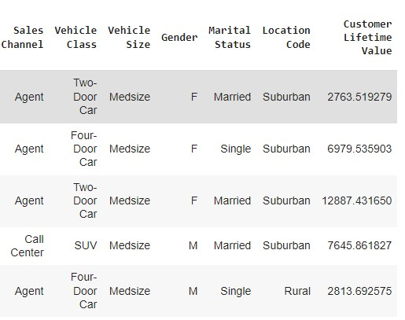
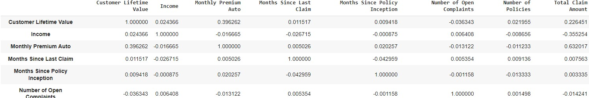
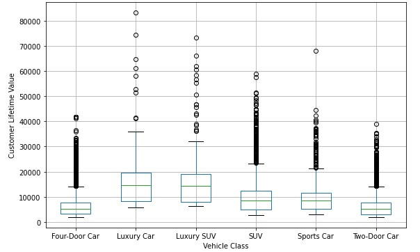
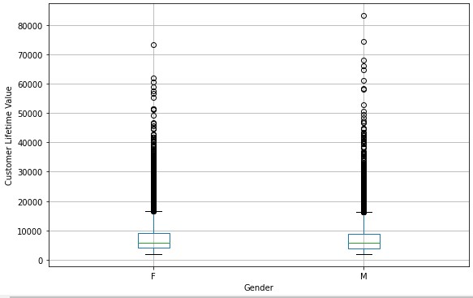
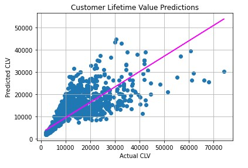
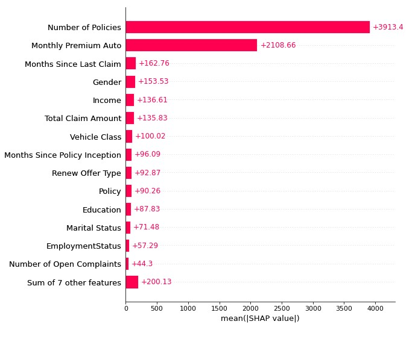
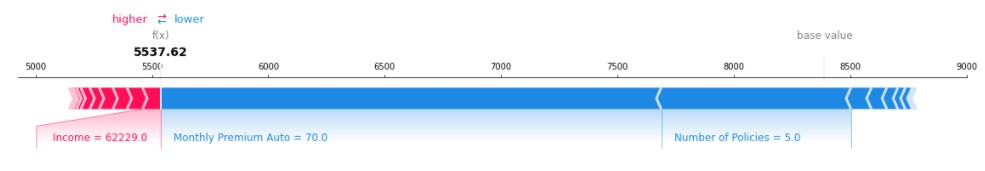
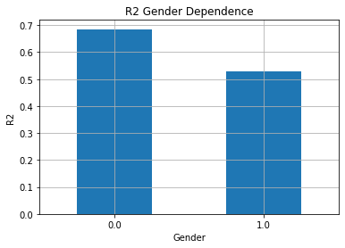
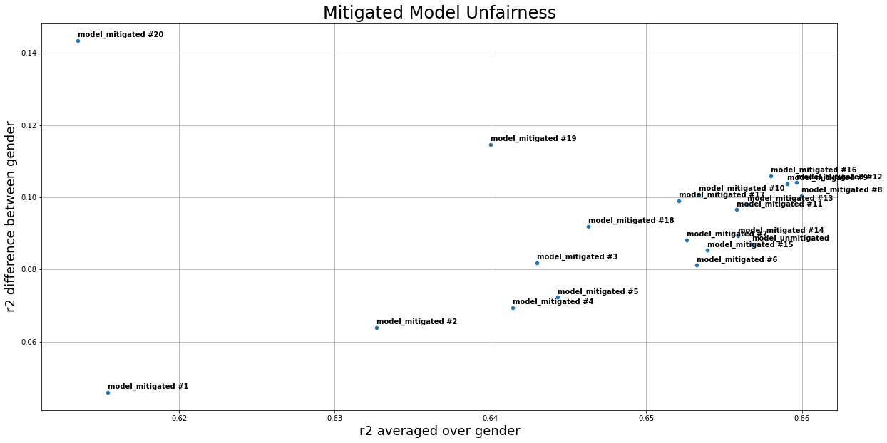

# Customer Lifetime Value Prediction Using Machine Learning

## **Project Overview**
The goal of this project is to: 
- visualize, explore and understand the relations in the dataset
- compare, train, tune and test regression model to predict life-time value for individual customers
- analyse feature importance and explain model decisions (explainable ai)
- analyse model fairness and eventually improve it 

### **Background**
>In marketing, customer lifetime value (CLV or often CLTV), lifetime customer value (LCV), or life-time value (LTV) is a prognostication of the net profit contributed to the whole future relationship with a customer. The prediction model can have varying levels of sophistication and accuracy, ranging from a crude heuristic to the use of complex predictive analytics techniques. One of the major uses of CLV is customer segmentation, which starts with the understanding that not all customers are equally important. CLV-based segmentation model allows the company to predict the most profitable group of customers, understand those customers' common characteristics, and focus more on them rather than on less profitable customers. CLV-based segmentation can be combined with a Share of Wallet (SOW) model to identify "high CLV but low SOW" customers with the assumption that the company's profit could be maximized by investing marketing resources in those customers. [**Ref:** https://en.wikipedia.org/wiki/Customer_lifetime_value]

### **Data Overview**

### **Exploratory Data Analysis (EDA)**
The pearson correlation analysis between numeric features and the target (i.e. CLV) reveals moderate correlations for the features "Monthly Premium Auto" and "Total Claim Amount".

The boxplots show a clear effect of the feature "Vehicle Class" on CLV.

With respect to gender, no apparent effect on CLV can be observed which is an important precondition for model fairness.

### **Model Evaluation**
For modeling the CLV, a "Light Gradient Boosting Machine" algorithm (LightGBM) was used explaining 68% (=R2) of the variance on unseen customer data.

### **Model Explanability**

In consistence with the EDA-findings the SHAP values reveal that overall the features "Number of Policies" and "Monthly Premium Auto" have a significant impact on CLV. The feature "Vehicle Class" in return has only moderate impact.

With focus on local model explanation (i.e. explaining single model decisions), the plot below shows the effects of the different features on the CLV of a single customer. We can see that the expected CLV is located around 8400 (base-value). The features "Monthly Premium Auto" and "Number of Policies" push the CLV to lower values of around 5100 whereas other features like "Income" have a positive effect increasing the CLV to the final value of around 5500.  

### **Model Fairness**
With respect to model fairness, the figure below shows the gender-biased model performance in terms of R2 towards the female subgroup. This indicates that the model can predict the CLV for women clearly better than for men. 

To mitigate this effect, several models were trained to find the best trade-off between model performance and model fairness, as depicted below.

As we can the, the average model performance of the unmitigated model was between r2=0.65 and r2=0.66 while the r2 group difference was between 0.08-0.10. However, to mitigate model unfairness, we could e.g. choose "model_mitigated #4" in order to clearly reduce the r2 group differnce to the range between 0.06-0.08 while preserving a strong model performance of r2 between r2=0.64 and r2=0.65.